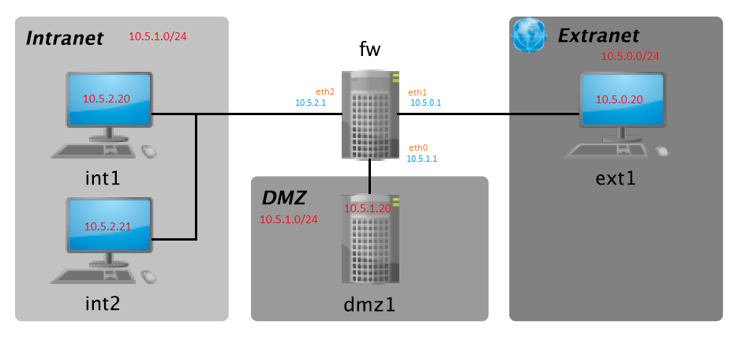
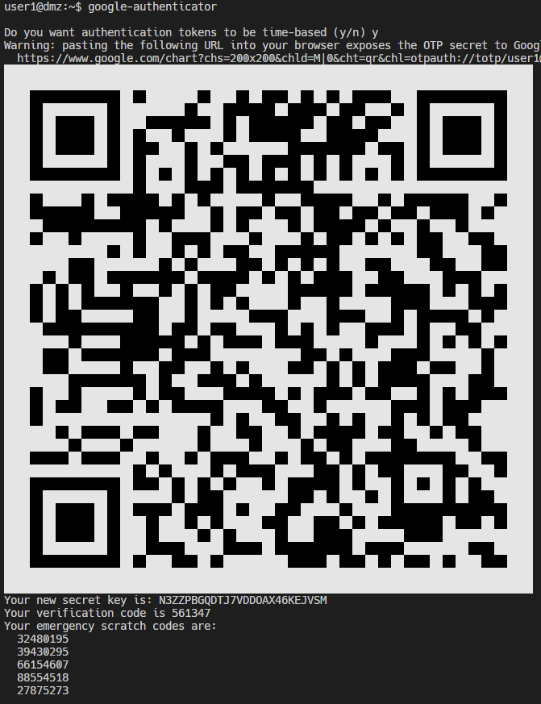
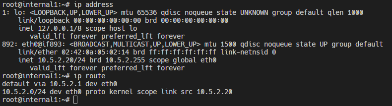
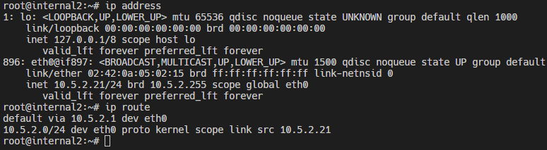
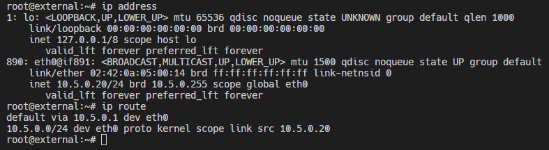
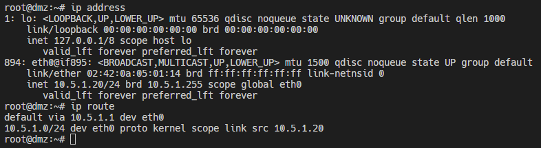
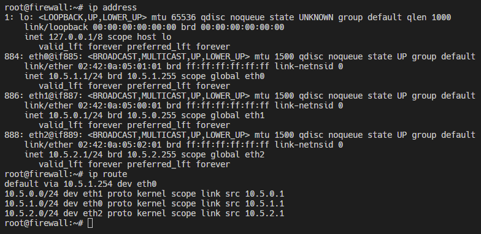

# Práctica DMZ - Sistemas Confiables

_Práctica 1 de la asignatura **Sistemas confiables** del máster universitario de investigación en Ciberseguridad de la Universidad de León_

## Dinámica de la práctica 🚀

Se pretende construir una DMZ (utilizando contenedores Docker para simular las máquinas) siguiendo la topología de red de la figura 1.


_Figura 1_

### Pre-requisitos 📋

_Que cosas necesitas para instalar el software y como instalarlas_

```
Docker Docker version 20.10.21, build baeda1f
Docker Compose version v2.12.2
```

## Archivos 📦

```
.
├── 📂 dmz
│   ├── 📄 000-default.conf     # Archivo de configuración de Apache
│   ├── 📄 banner               # Banner de SSH
│   ├── 📄 Dockerfile           # Dockerfile para construir la imagen de la DMZ
│   ├── 📄 id_rsa.pub           # Clave pública para autenticación SSH
│   ├── 📄 index.html           # Página web de la DMZ
│   ├── 📄 jail.conf            # Archivo de configuración de Fail2Ban
│   ├── 📄 sshd                 # Archivo de configuración de SSH
│   ├── 📄 sshd_config          # Archivo de configuración de SSH
│   └── 📄 start.sh             # Script para iniciar la DMZ    
├── 📄 dmz.pdf                  # Documentación de la práctica
├── 📄 docker-compose.yml       # Archivo de configuración de Docker Compose
├── 📂 external
│   ├── 📄 Dockerfile           # Dockerfile para la imágen de la Extranet
│   └── 📄 start.sh             # Script para iniciar la Extranet
├── 📂 fw
│   ├── 📄 Dockerfile           # Dockerfile para la imágen del Firewall
│   ├── 📄 iptables.sh          # Script para configurar el Firewall
│   └── 📄 start.sh             # Script para iniciar el Firewall
├── 📂 img
│   └── 📸 dmz.png              # Imagen de la topología de red
├── 📂 internal
│   ├── 📄 Dockerfile           # Dockerfile para la imágen de la Intranet
│   └── 📄 start.sh             # Script para iniciar la Intranet
├── README.md                   
└── 📂 scripts
    ├── 📄 dmz.sh               # Script para iniciar la consola DMZ    
    ├── 📄 external.sh          # Script para iniciar la consola Extranet
    ├── 📄 firewall.sh          # Script para iniciar la consola Firewall
    ├── 📄 internal1.sh         # Script para iniciar la consola Intranet1
    ├── 📄 internal2.sh         # Script para iniciar la consola Intranet2
    └── 📄 run.sh               # Script para para los contenedores,reconstruir las imágenes 
                                y volver a iniciar los contenedores
```

## Vídeo demostrativo de funcionamiento 🎥

**Practica DMZ  en Docker | Sistemas confiables | Master de ciberseguridad | pbarrn00 | Unileon** 

[](https://youtu.be/6kdZ9czhXQU)

## Indicaciones para la ejecución de la práctica 📖

#### Google Authentication (Double Factor Authentication) 📱
Para utilizar correctamente el servicio ssh de la dmz con la autenticación de doble factor, es necesario tener configurado google-authenticator en el sistema operativo del cliente en nuestro caso _**User1**_. Para ello, se debe ejecutar el siguiente comando:

```
google-authenticator
```
Debemos escanear el código QR que nos proporciona el comando anterior y escribir el código que nos proporciona la aplicación de google-authenticator en el teléfono móvil. Una vez hecho esto, se nos solicitará un código de verificación cada vez que nos conectemos al servicio ssh de la dmz.



#### Inicio del servicio fail2ban 🚫
Por alguna razón desconocida, el servicio fail2ban no se inicia automáticamente al iniciar el contenedor de la dmz a pesar de estar en el archivo _**start sh**_. Para iniciar el servicio fail2ban, se debe ejecutar el siguiente comando:

```
service fail2ban start
```

#### Añadir la clave pública al directorio DMZ ♿
Si queremos probar la funcionalidad del inicio de sesión SSH debemos añadir una clave publica (por ejemplo la del equipo anfitrión) al directorio dmz como se indica en el apartado de archivos. El nombre del archivo de la clave pública debe ser id_rsa.pub como se indica en el inventario de archivos ya que en el Dockerfile se copia esa clave en los authorized_keys del servidor SSH de la DMZ.
```
ssh-keygen
cp ~/.ssh/id_rsa.pub /path/to/DMZ/practice/dmz/id_rsa.pub
```

## Direcciones IP 💻

#### Internal1

#### Internal2

#### External

#### DMZ

#### Firewall


## Construido con 🛠️

* [RPi 4](https://www.amazon.es/Raspberry-Pi-4595-Modelo-GB/dp/B09TTNF8BT) - Raspberry Pi 4 Model B 4GB RAM
* [Docker](https://docs.docker.com/engine/release-notes/) - Docker version 20.10.21
* [Raspberry Pi OS](https://www.raspberrypi.com/software/) - Raspbian GNU/Linux 10 (buster)
* [OpenVPN](https://openvpn.net/community-downloads/) - OpenVPN 2.4.11


## Autores ✒️


* **Pablo Javier Barrio Navarro** - *Realización de la Práctica DMZ* - [Pablo Javier Barrio Navarro](https://github.com/pbarrn00) 
* **Ángel Manuel Guerrero Higueras** - *Propuesta de la Práctica DMZ* - [Ángel Manuel Guerrero Higueras](https://www.researchgate.net/profile/Angel-Guerrero-Higueras)

## _My Social Media_ 🔗

* [Youtube](https://www.youtube.com/channel/UC5waeaJaVlue9qGkHp4557Q)  📢
* [Github](https://github.com/pbarrn00) 😺
* [LinkedIn](https://github.com/pbarrn00) ☑️
* [Twitter](https://twitter.com/pablosky157) 🐦
* [Onkisko Web](https://onkisko.es/) 📰


---
⌨️ con ❤️ por [NoobInTheNet](https://github.com/pbarrn00) 😊
